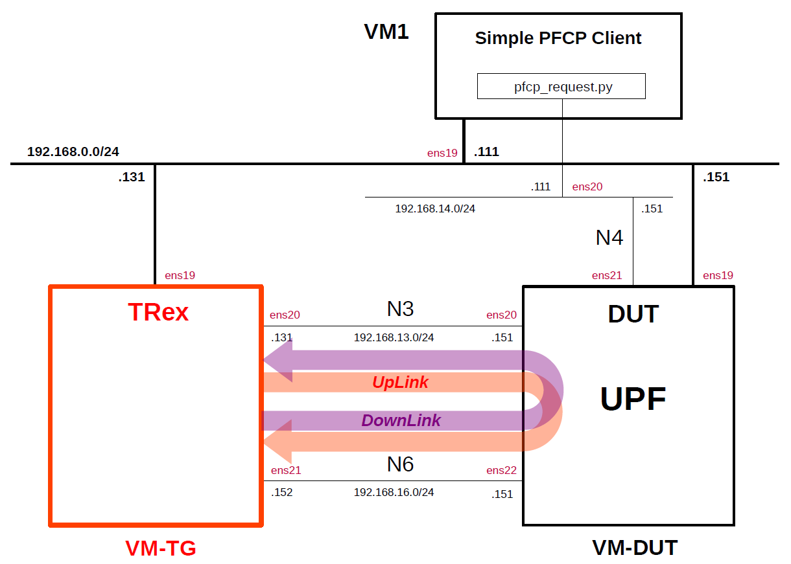

# Simple Measurement of UPF Performance 6
This describes simple performance measurements of several open source UPFs by using the traffic generator [TRex](https://github.com/cisco-system-traffic-generator/trex-core) as the performance measurement tool and [Simple PFCP Client](https://github.com/s5uishida/simple_pfcp_client) as the PFCP simulator.
This was measured on the VMs on Proxmox VE.
For other measurement results, please see [Performance Measurement](https://github.com/s5uishida/sample_config_misc_for_mobile_network#performance_measurement).

**Note. Performance measurement results are highly dependent on the measurement conditions. These results are only examples of results under certain measurement conditions.
And this is a very simple measurement, and according to [this comment](https://github.com/open5gs/open5gs/discussions/1780#discussioncomment-10853290), it doesn't seem to make much sense to measure between VMs. I hope it will serve as a reference for a simple configuration when measuring on real devices.**

---

### [Sample Configurations and Miscellaneous for Mobile Network](https://github.com/s5uishida/sample_config_misc_for_mobile_network)

---

<a id="toc"></a>

## Table of Contents

- [Simple Overview of UPF Performance Measurements](#overview)
- [Changes in configuration files of Simple PFCP Client, TRex and UPFs](#changes)
  - [Changes in configuration files of Simple PFCP Client](#changes_pfcp)
  - [Changes in configuration files of TRex](#changes_trex)
  - [Changes in configuration files of UPFs](#changes_up)
    - [a-1. Changes in configuration files of Open5GS 5GC UPF (TUN)](#changes_up_a1)
    - [a-2. Changes in configuration files of Open5GS 5GC UPF (TAP)](#changes_up_a2)
    - [b. Changes in configuration files of free5GC 5GC UPF](#changes_up_b)
    - [c. Changes in configuration files of UPG-VPP](#changes_up_c)
    - [d. Changes in configuration files of eUPF](#changes_up_d)
- [Network settings of TRex and UPFs](#network_settings)
  - [Network settings of TRex](#network_settings_trex)
  - [a-1. Network settings of Open5GS 5GC UPF (TUN)](#network_settings_up_a1)
  - [a-2. Network settings of Open5GS 5GC UPF (TAP)](#network_settings_up_a2)
  - [b. Network settings of free5GC 5GC UPF](#network_settings_up_b)
  - [c. Network settings of UPG-VPP](#network_settings_up_c)
  - [d. Network settings of eUPF](#network_settings_up_d)
- [Build Simple PFCP Client, TRex and UPFs](#build)
- [Run Simple PFCP Client, TRex and UPFs](#run)
  - [Run UPFs](#run_up)
    - [a-1. Run Open5GS 5GC UPF (TUN)](#run_up_a1)
    - [a-2. Run Open5GS 5GC UPF (TAP)](#run_up_a2)
    - [b. Run free5GC 5GC UPF](#run_up_b)
    - [c. Run UPG-VPP](#run_up_c)
    - [d. Run eUPF](#run_up_d)
  - [Run Simple PFCP Client](#run_pfcp)
  - [Run TRex](#run_trex)
- [Measure UPF Performance](#measure)
- [Results](#results)
  - [Summary](#summary)
  - [Performance of N6 interface only](#n6_performance)
- [Changelog (summary)](#changelog)

---

<a id="overview"></a>

## Simple Overview of UPF Performance Measurements

I will easily measure the performance of several open source UPFs by using TRex as the traffic generator and Simple PFCP Client as the PFCP simulator.
**Note that this configuration is implemented with Proxmox VE VMs.**

The following minimum configuration was set as a condition.
- One PFCP client, TRex and DUT (UPF)

The built simulation environment is as follows.

</img>

Simple PFCP Client, TRex used are as follows.
- Simple PFCP Client (2025.01.16) - https://github.com/s5uishida/simple_pfcp_client
- TRex v3.06 (2024.09.17) - https://github.com/cisco-system-traffic-generator/trex-core
- Scapy v2.6.1 (2024.11.05) - https://github.com/secdev/scapy

The UPFs used are as follows.
- Open5GS v2.7.2 (2025.01.12) - https://github.com/open5gs/open5gs
- free5GC UPF (go-upf) v1.2.4 (2025.01.02) - https://github.com/free5gc/go-upf  
  gtp5g v0.9.8 (2025.01.14) - https://github.com/free5gc/gtp5g
- UPG-VPP v1.13.0 (2024.03.25) - https://github.com/travelping/upg-vpp
- eUPF v0.6.4 (2024.12.23) - https://github.com/edgecomllc/eupf

Each VMs are as follows.  
| VM | SW & Role | IP address | OS | CPU | Mem | HDD |
| --- | --- | --- | --- | --- | --- | --- |
| VM1 | Simple PFCP Client | 192.168.0.111/24 | Ubuntu 24.04 | 1 | 1GB | 10GB |
| VM-TG | TRex<br>Traffic Generator | 192.168.0.131/24 | Ubuntu 22.04 | 3 | 8GB | 20GB |
| **VM-DUT** | **each UPF DUT<br>(Device Under Test)** | **192.168.0.151/24** | **Ubuntu 24.04<br>or 22.04** | **2** | **8GB** | **20GB** |

**Each VM-DUT(UPFs) are as follows.**
| # | SW / *packet processing* | Date | Commit | OS |
| --- | --- | --- | --- | --- |
| a | Open5GS UPF v2.7.2<br>***user space*** | 2025.01.12 | `13585a34e3d5505dd86d2cdf78c91829f3936851` | Ubuntu 24.04 |
| b | free5GC UPF<br>(go-upf) v1.2.4<br>***kernel module*** | 2025.01.02 | `88fbd8bb7b86761cbbcf1367acf2df7d81392ce3` | Ubuntu 24.04 |
| c | UPG-VPP v1.13.0<br>***VPP/DPDK*** | 2024.03.25 | `dfdf64000566d35955d7c180720ff66086bd3572` | Ubuntu 22.04 |
| d | eUPF v0.6.4<br>***eBPF/XDP*** | 2024.12.23 | `307b80aec8c7bc8fa376e03927c2f5c55a1fd687` | Ubuntu 24.04 |

The network interfaces of each VM except VM-DUT are as follows.
| VM | Device | Model | Linux Bridge | IP address | Interface |
| --- | --- | --- | --- | --- | --- |
| VM1 | ens18 | VirtIO | vmbr1 | 10.0.0.111/24 | (NAPT NW) |
| | ens19 | VirtIO | mgbr0 | 192.168.0.111/24 | (Mgmt NW) |
| | ens20 | VirtIO | vmbr4 | 192.168.14.111/24 | N4 |
| VM-TG | ens18 | VirtIO | vmbr1 | 10.0.0.131/24 | (NAPT NW) |
| | ens19 | VirtIO | mgbr0 | 192.168.0.131/24 | (Mgmt NW) |
| | ens20 | VirtIO | vmbr3 | 192.168.13.131/24 | N3 ***(Under DPDK by uio_pci_generic)*** |
| | ens21 | VirtIO | vmbr6 | 192.168.16.152/24 | N6 ***(Under DPDK by uio_pci_generic)*** |

**The network interfaces of each VM-DUT(UPFs) are as follows.**
| # | SW | Device | Model | Linux Bridge | IP address | Interface |
| --- | --- | --- | --- | --- | --- | --- |
| a | Open5GS UPF | ~~ens18~~ | ~~VirtIO~~ | ~~vmbr1~~ | ~~10.0.0.151/24~~ | ~~(NAPT NW)~~ ***down*** |
| | | ens19 | VirtIO | mgbr0 | 192.168.0.151/24 | (Mgmt NW) |
| | | ens20 | VirtIO | vmbr3 | 192.168.13.151/24 | N3 |
| | | ens21 | VirtIO | vmbr4 | 192.168.14.151/24 | N4 |
| | | ens22 | VirtIO | vmbr6 | 192.168.16.151/24 | N6 |
| b | free5GC UPF<br>(go-upf) | ~~ens18~~ | ~~VirtIO~~ | ~~vmbr1~~ | ~~10.0.0.151/24~~ | ~~(NAPT NW)~~ ***down*** |
| | | ens19 | VirtIO | mgbr0 | 192.168.0.151/24 | (Mgmt NW) |
| | | ens20 | VirtIO | vmbr3 | 192.168.13.151/24 | N3 |
| | | ens21 | VirtIO | vmbr4 | 192.168.14.151/24 | N4 |
| | | ens22 | VirtIO | vmbr6 | 192.168.16.151/24 | N6 |
| c | UPG-VPP | ens18 | VirtIO | vmbr1 | 10.0.0.151/24 | (NAPT NW) |
| | | ens19 | VirtIO | mgbr0 | 192.168.0.151/24 | (Mgmt NW) |
| | | ens20 | VirtIO | vmbr3 | 192.168.13.151/24 | N3 ***(Under DPDK by vfio-pci)*** |
| | | ens21 | VirtIO | vmbr4 | 192.168.14.151/24 | N4 ***(Under DPDK by vfio-pci)*** |
| | | ens22 | VirtIO | vmbr6 | 192.168.16.151/24 | N6 ***(Under DPDK by vfio-pci)*** |
| d | eUPF | ~~ens18~~ | ~~VirtIO~~ | ~~vmbr1~~ | ~~10.0.0.151/24~~ | ~~(NAPT NW)~~ ***down*** |
| | | ens19 | VirtIO | mgbr0 | 192.168.0.151/24 | (Mgmt NW) |
| | | ens20 | VirtIO | vmbr3 | 192.168.13.151/24 | N3 ***(XDP)*** |
| | | ens21 | VirtIO | vmbr4 | 192.168.14.151/24 | N4 |
| | | ens22 | VirtIO | vmbr6 | 192.168.16.151/24 | N6 ***(XDP)*** |

Linux Bridges of Proxmox VE are as follows.
| Linux Bridge | Network CIDR | Interface |
| --- | --- | --- |
| vmbr1 | 10.0.0.0/24 | NAPT NW |
| mgbr0 | 192.168.0.0/24 | Mgmt NW |
| vmbr3 | 192.168.13.0/24 | N3 |
| vmbr4 | 192.168.14.0/24 | N4 |
| vmbr6 | 192.168.16.0/24 | N6 |

UE IP address and TEID are as follows.
| UE IP address | TEID |
| --- | --- |
| 10.45.0.2/24 | 0x00000001 |

<a id="changes"></a>

## Changes in configuration files of Simple PFCP Client, TRex and UPFs

Please refer to the following for building Simple PFCP Client, TRex and UPFs respectively.
- Simple PFCP Client (2025.01.16) - https://github.com/s5uishida/simple_pfcp_client
- TRex v3.06 (2024.09.17) - https://github.com/s5uishida/install_trex
- Open5GS v2.7.2 (2025.01.12) - https://open5gs.org/open5gs/docs/guide/02-building-open5gs-from-sources/
- free5GC UPF (go-upf) v1.2.4 (2025.01.02) - https://free5gc.org/guide/
- UPG-VPP v1.13.0 (2024.03.25) - https://github.com/s5uishida/install_vpp_upf_dpdk#annex_1
- eUPF v0.6.4 (2024.12.23) - https://github.com/s5uishida/install_eupf

<a id="changes_pfcp"></a>

### Changes in configuration files of Simple PFCP Client

See [here](https://github.com/s5uishida/simple_pfcp_client#set_param) for the original file.

- `/root/pfcp_request.py`  
There is no change.

<a id="changes_trex"></a>

### Changes in configuration files of TRex

See [here](https://github.com/s5uishida/install_trex#config) for the original file.

- `/etc/trex_cfg.yaml`  
There is no change.

See [here](https://github.com/s5uishida/install_trex?tab=readme-ov-file#load_profile) for the original load profiles.

- `/opt/trex/stl/gtp_1pkt_simple.py` for UpLink  
There is no change.

- `/opt/trex/stl/udp_1pkt_simple.py` for DownLink  
There is no change.

<a id="changes_up"></a>

### Changes in configuration files of UPFs

<a id="changes_up_a1"></a>

#### a-1. Changes in configuration files of Open5GS 5GC UPF (TUN)

- `open5gs/install/etc/open5gs/upf.yaml`
```diff
--- upf.yaml.orig       2024-05-02 19:52:00.000000000 +0900
+++ upf.yaml        2024-05-19 12:38:00.000000000 +0900
@@ -11,18 +11,18 @@
 upf:
   pfcp:
     server:
-      - address: 127.0.0.7
+      - address: 192.168.14.151
     client:
 #      smf:     #  UPF PFCP Client try to associate SMF PFCP Server
 #        - address: 127.0.0.4
   gtpu:
     server:
-      - address: 127.0.0.7
+      - address: 192.168.13.151
   session:
     - subnet: 10.45.0.0/16
       gateway: 10.45.0.1
-    - subnet: 2001:db8:cafe::/48
-      gateway: 2001:db8:cafe::1
+      dnn: internet
+      dev: ogstun
   metrics:
     server:
       - address: 127.0.0.7
```

<a id="changes_up_a2"></a>

#### a-2. Changes in configuration files of Open5GS 5GC UPF (TAP)

- `open5gs/install/etc/open5gs/upf.yaml`
```diff
--- upf.yaml.orig       2024-05-02 19:52:00.000000000 +0900
+++ upf.yaml        2024-09-23 14:00:20.724467385 +0900
@@ -11,18 +11,18 @@
 upf:
   pfcp:
     server:
-      - address: 127.0.0.7
+      - address: 192.168.14.151
     client:
 #      smf:     #  UPF PFCP Client try to associate SMF PFCP Server
 #        - address: 127.0.0.4
   gtpu:
     server:
-      - address: 127.0.0.7
+      - address: 192.168.13.151
   session:
     - subnet: 10.45.0.0/16
       gateway: 10.45.0.1
-    - subnet: 2001:db8:cafe::/48
-      gateway: 2001:db8:cafe::1
+      dnn: internet
+      dev: ogstap
   metrics:
     server:
       - address: 127.0.0.7
```

<a id="changes_up_b"></a>

#### b. Changes in configuration files of free5GC 5GC UPF

- `go-upf/upfcfg.yaml`
```diff
--- upfcfg.yaml.orig    2024-10-14 04:53:12.341028732 +0900
+++ upfcfg.yaml 2024-10-14 06:11:36.636303534 +0900
@@ -4,8 +4,8 @@
 # PFCP Configuration
 # The listen IP and nodeID of the N4 interface on this UPF (Can't set to 0.0.0.0)
 pfcp:
-  addr: 127.0.0.8   # IP addr for listening
-  nodeID: 127.0.0.8 # External IP or FQDN can be reached
+  addr: 192.168.14.151   # IP addr for listening
+  nodeID: 192.168.14.151 # External IP or FQDN can be reached
   retransTimeout: 1s # retransmission timeout
   maxRetrans: 3 # the max number of retransmission
 
@@ -18,7 +18,7 @@
   # If you bind to a specific IP, ensure SMF uses the same IP in its N3 configuration.
   # If you bind to all (0.0.0.0), SMF can use any of the available UPF IPs, but do not use 0.0.0.0 in SMF.
   ifList:
-    - addr: 127.0.0.8
+    - addr: 192.168.13.151
       type: N3
       # name: upf.5gc.nctu.me
       # ifname: gtpif
@@ -28,9 +28,7 @@
 # List of Data Network Names (DNN) supported by this UPF.
 dnnList:
   - dnn: internet # Data Network Name
-    cidr: 10.60.0.0/16 # Classless Inter-Domain Routing for assigned IPv4 pool of UE
-  - dnn: internet # Data Network Name
-    cidr: 10.61.0.0/16 # Classless Inter-Domain Routing for assigned IPv4 pool of UE
+    cidr: 10.45.0.0/16 # Classless Inter-Domain Routing for assigned IPv4 pool of UE
     # natifname: eth0
 
 # Logging Configuration
```

<a id="changes_up_c"></a>

#### c. Changes in configuration files of UPG-VPP

See [here](https://github.com/s5uishida/install_vpp_upf_dpdk#changes_up) for the original files.

- `openair-upf/startup.conf`  
There is no change.

- `openair-upf/init.conf`  
There is no change.

<a id="changes_up_d"></a>

#### d. Changes in configuration files of eUPF

See [here](https://github.com/s5uishida/install_eupf#create-configuration-file) for the original file.

- `eupf/config.yml`  
There is no change.

<a id="network_settings"></a>

## Network settings of TRex and UPFs

<a id="network_settings_trex"></a>

### Network settings of TRex

Set the OS kernel parameter according to [this](https://github.com/s5uishida/install_trex#set_param).

<a id="network_settings_up_a1"></a>

### a-1. Network settings of Open5GS 5GC UPF (TUN)

First, uncomment the next line in the `/etc/sysctl.conf` file and reflect it in the OS.
```
net.ipv4.ip_forward=1
```
```
# sysctl -p
```
Next, down the interface `ens18` of the VM-DUT to delete default GW.
```
# ip link set dev ens18 down
```
Then, configure the TUNnel interface.
```
# ip tuntap add name ogstun mode tun
# ip addr add 10.45.0.1/16 dev ogstun
# ip link set ogstun up
```

<a id="network_settings_up_a2"></a>

### a-2. Network settings of Open5GS 5GC UPF (TAP)

First, uncomment the next line in the `/etc/sysctl.conf` file and reflect it in the OS.
```
net.ipv4.ip_forward=1
```
```
# sysctl -p
```
Next, down the interface `ens18` of the VM-DUT to delete default GW.
```
# ip link set dev ens18 down
```
Then, configure the TAP interface.
```
# ip tuntap add name ogstap mode tap
# ip addr add 10.45.0.1/16 dev ogstap
# ip link set ogstap up
```

<a id="network_settings_up_b"></a>

### b. Network settings of free5GC 5GC UPF

First, uncomment the next line in the `/etc/sysctl.conf` file and reflect it in the OS.
```
net.ipv4.ip_forward=1
```
```
# sysctl -p
```
Next, down the interface `ens18` of the VM-DUT to delete default GW.
```
# ip link set dev ens18 down
```

<a id="network_settings_up_c"></a>

### c. Network settings of UPG-VPP

See [this](https://github.com/s5uishida/install_vpp_upf_dpdk#setup_up).

<a id="network_settings_up_d"></a>

### d. Network settings of eUPF

First, uncomment the next line in the `/etc/sysctl.conf` file and reflect it in the OS.
```
net.ipv4.ip_forward=1
```
```
# sysctl -p
```
Next, down the interface `ens18` of the VM-DUT to delete default GW.
```
# ip link set dev ens18 down
```

<a id="build"></a>

## Build Simple PFCP Client, TRex and UPFs

Please refer to the following for building Simple PFCP Client, TRex and UPFs respectively.
- Simple PFCP Client (2025.01.16) - https://github.com/s5uishida/simple_pfcp_client
- TRex v3.06 (2024.09.17) - https://github.com/s5uishida/install_trex
- Open5GS v2.7.2 (2025.01.12) - https://open5gs.org/open5gs/docs/guide/02-building-open5gs-from-sources/
- free5GC UPF (go-upf) v1.2.4 (2025.01.02) - https://github.com/s5uishida/install_goupf
- UPG-VPP v1.13.0 (2024.03.25) - https://github.com/s5uishida/install_vpp_upf_dpdk#annex_1
- eUPF v0.6.4 (2024.12.23) - https://github.com/s5uishida/install_eupf

<a id="run"></a>

## Run Simple PFCP Client, TRex and UPFs

First run each UPF, then Simple PFCP Client and TRex last.
Each UPF uses the same IP address, so start only the UPF you want to measure.

<a id="run_up"></a>

### Run UPFs

<a id="run_up_a1"></a>

#### a-1. Run Open5GS 5GC UPF (TUN)

Please use the configuration files changed for TUN interface.
```
# cd open5gs
# ./install/bin/open5gs-upfd
```

<a id="run_up_a2"></a>

#### a-2. Run Open5GS 5GC UPF (TAP)

Please use the configuration files changed for TAP interface.
```
# cd open5gs
# ./install/bin/open5gs-upfd
```

<a id="run_up_b"></a>

#### b. Run free5GC 5GC UPF

```
# cd go-upf
# ./upf -c upfcfg.yaml
```

<a id="run_up_c"></a>

#### c. Run UPG-VPP

See [this](https://github.com/s5uishida/install_vpp_upf_dpdk#run_upg_vpp).

<a id="run_up_d"></a>

#### d. Run eUPF

See [this](https://github.com/s5uishida/install_eupf#run).

<a id="run_pfcp"></a>

### Run Simple PFCP Client

See [this](https://github.com/s5uishida/simple_pfcp_client#run).

<a id="run_trex"></a>

### Run TRex

Please refer to [this](https://github.com/s5uishida/install_trex#run) to run TRex.

<a id="measure"></a>

## Measure UPF Performance

Please see below for methods for measuring UpLink and DownLink performances.
- [UpLink measurement](https://github.com/s5uishida/install_trex#ul_measurement)
- [DownLink measurement](https://github.com/s5uishida/install_trex#dl_measurement)

<a id="results"></a>

## Results

In this measurement, the UDP payload size is set to 1400 bytes.

| # | UPF / Date | UpLink<br>Gbps | <br>Kpps | <br>CPU%[1] | DownLink<br>Gbps | <br>Kpps | <br>CPU%[1] |
| --- | --- | --- | --- | --- | --- | --- | --- |
| a-1 | Open5GS UPF v2.7.2 (TUN)<br>2025.01.12 | Tx:1.79<br>Rx:1.08 | Tx:150.07<br>Rx:93.65 | 1.68 | Tx:1.74<br>Rx:1.33 | Tx:150.36<br>Rx:111.87 | 1.89 |
| a-2 | Open5GS UPF v2.7.2 (TAP)<br>2025.01.12 | Tx:1.79<br>Rx:1.16 | Tx:150.14<br>Rx:100.07 | 1.56 | Tx:1.74<br>Rx:1.17 | Tx:150.11<br>Rx:98.55 | 1.51 |
| b | free5GC UPF v1.2.4<br>2025.01.02 | Tx:5.96<br>Rx:4.8 | Tx:500.31<br>Rx:414.59 | 5.39 | Tx:4.05<br>Rx:3.03 | Tx:350.09<br>Rx:254.98 | 4.23 |
| c | UPG-VPP v1.13.0<br>2024.03.25 | Tx:9.42<br>Rx:6.87 | Tx:790.31<br>Rx:593.79 | 12.54 | Tx:10.31<br>Rx:6.94 | Tx:891.25<br>Rx:585.1 | 12.13 |
| d | eUPF v0.6.4 (native mode)<br>2024.12.23 | Tx:11.67<br>Rx:9.42 | Tx:978.83<br>Rx:814.75 | 48.75 | Tx:11.24<br>Rx:9.77 | Tx:971.56<br>Rx:819.85 | 44.25 |

1. CPU load - per core of TRex VM (VM-TG). In this case only one core is used.

<details><summary>a-1. logs for Open5GS UPF v2.7.2 (TUN)</summary>

**UpLink measurement**
```
start -f stl/gtp_1pkt_simple.py -p 0 -m 150kpps -d 60
```
```
Global Statistics

connection   : localhost, Port 4501                       total_tx_L2  : 1.79 Gbps
version      : STL @ v3.06                                total_tx_L1  : 1.81 Gbps
cpu_util.    : 1.68% @ 1 cores (1 per dual port)          total_rx     : 1.08 Gbps
rx_cpu_util. : 0.18% / 93.65 Kpps                         total_pps    : 150.07 Kpps
async_util.  : 0% / 4.79 bps                              drop_rate    : 705.53 Mbps
total_cps.   : 0 cps                                      queue_full   : 12,034 pkts

Port Statistics

   port    |         0         |         1         |       total       
-----------+-------------------+-------------------+------------------
owner      |              root |              root |                   
link       |                UP |                UP |                   
state      |      TRANSMITTING |              IDLE |                   
speed      |          200 Gb/s |          200 Gb/s |                   
CPU util.  |             1.68% |              0.0% |                   
--         |                   |                   |                   
Tx bps L2  |         1.79 Gbps |          0.09 bps |         1.79 Gbps 
Tx bps L1  |         1.81 Gbps |          0.13 bps |         1.81 Gbps 
Tx pps     |       150.07 Kpps |             0 pps |       150.07 Kpps 
Line Util. |            0.91 % |               0 % |                   
---        |                   |                   |                   
Rx bps     |             0 bps |         1.08 Gbps |         1.08 Gbps 
Rx pps     |             0 pps |        93.65 Kpps |        93.65 Kpps 
----       |                   |                   |                   
opackets   |           2687829 |                 1 |           2687830 
ipackets   |                 0 |           1739130 |           1739130 
obytes     |        4004865210 |                46 |        4004865256 
ibytes     |                 0 |        2514780580 |        2514780580 
tx-pkts    |        2.69 Mpkts |            1 pkts |        2.69 Mpkts 
rx-pkts    |            0 pkts |        1.74 Mpkts |        1.74 Mpkts 
tx-bytes   |              4 GB |              46 B |              4 GB 
rx-bytes   |               0 B |           2.51 GB |           2.51 GB 
-----      |                   |                   |                   
oerrors    |                 0 |                 0 |                 0 
ierrors    |                 0 |                 0 |                 0 

status:  |

Press 'ESC' for navigation panel...
status: 

tui>
```
**DownLink measurement**
```
start -f stl/udp_1pkt_simple.py -p 1 -m 150kpps -d 60
```
```
Global Statistics

connection   : localhost, Port 4501                       total_tx_L2  : 1.74 Gbps
version      : STL @ v3.06                                total_tx_L1  : 1.76 Gbps
cpu_util.    : 1.89% @ 1 cores (1 per dual port)          total_rx     : 1.33 Gbps
rx_cpu_util. : 0.21% / 111.87 Kpps                        total_pps    : 150.36 Kpps
async_util.  : 0% / 9.02 bps                              drop_rate    : 413.05 Mbps
total_cps.   : 0 cps                                      queue_full   : 3,817 pkts

Port Statistics

   port    |         0         |         1         |       total       
-----------+-------------------+-------------------+------------------
owner      |              root |              root |                   
link       |                UP |                UP |                   
state      |              IDLE |      TRANSMITTING |                   
speed      |          200 Gb/s |          200 Gb/s |                   
CPU util.  |              0.0% |             1.89% |                   
--         |                   |                   |                   
Tx bps L2  |          1.41 bps |         1.74 Gbps |         1.74 Gbps 
Tx bps L1  |          2.02 bps |         1.76 Gbps |         1.76 Gbps 
Tx pps     |             0 pps |       150.36 Kpps |       150.36 Kpps 
Line Util. |               0 % |            0.88 % |                   
---        |                   |                   |                   
Rx bps     |         1.33 Gbps |             0 bps |         1.33 Gbps 
Rx pps     |       111.87 Kpps |             0 pps |       111.87 Kpps 
----       |                   |                   |                   
opackets   |                 1 |           2007396 |           2007397 
ipackets   |           1304349 |                 0 |           1304349 
obytes     |                46 |        2902694616 |        2902694662 
ibytes     |        1933043782 |                 0 |        1933043782 
tx-pkts    |            1 pkts |        2.01 Mpkts |        2.01 Mpkts 
rx-pkts    |         1.3 Mpkts |            0 pkts |         1.3 Mpkts 
tx-bytes   |              46 B |            2.9 GB |            2.9 GB 
rx-bytes   |           1.93 GB |               0 B |           1.93 GB 
-----      |                   |                   |                   
oerrors    |                 0 |                 0 |                 0 
ierrors    |                 0 |                 0 |                 0 

status:  |

Press 'ESC' for navigation panel...
status: 

tui>
```

</details>

<details><summary>a-2. logs for Open5GS UPF v2.7.2 (TAP)</summary>

**UpLink measurement**
```
start -f stl/gtp_1pkt_simple.py -p 0 -m 150kpps -d 60
```
```
Global Statistics

connection   : localhost, Port 4501                       total_tx_L2  : 1.79 Gbps
version      : STL @ v3.06                                total_tx_L1  : 1.81 Gbps
cpu_util.    : 1.56% @ 1 cores (1 per dual port)          total_rx     : 1.16 Gbps
rx_cpu_util. : 0.1% / 100.07 Kpps                         total_pps    : 150.14 Kpps
async_util.  : 0% / 7.67 bps                              drop_rate    : 632.05 Mbps
total_cps.   : 0 cps                                      queue_full   : 5,803 pkts

Port Statistics

   port    |         0         |         1         |       total       
-----------+-------------------+-------------------+------------------
owner      |              root |              root |                   
link       |                UP |                UP |                   
state      |      TRANSMITTING |              IDLE |                   
speed      |          200 Gb/s |          200 Gb/s |                   
CPU util.  |             1.56% |              0.0% |                   
--         |                   |                   |                   
Tx bps L2  |         1.79 Gbps |          2.85 bps |         1.79 Gbps 
Tx bps L1  |         1.81 Gbps |          4.08 bps |         1.81 Gbps 
Tx pps     |       150.14 Kpps |          0.01 pps |       150.14 Kpps 
Line Util. |            0.91 % |               0 % |                   
---        |                   |                   |                   
Rx bps     |             0 bps |         1.16 Gbps |         1.16 Gbps 
Rx pps     |             0 pps |       100.07 Kpps |       100.07 Kpps 
----       |                   |                   |                   
opackets   |           1867650 |                 1 |           1867651 
ipackets   |                 0 |           1268363 |           1268363 
obytes     |        2782798500 |                46 |        2782798546 
ibytes     |                 0 |        1834051498 |        1834051498 
tx-pkts    |        1.87 Mpkts |            1 pkts |        1.87 Mpkts 
rx-pkts    |            0 pkts |        1.27 Mpkts |        1.27 Mpkts 
tx-bytes   |           2.78 GB |              46 B |           2.78 GB 
rx-bytes   |               0 B |           1.83 GB |           1.83 GB 
-----      |                   |                   |                   
oerrors    |                 0 |                 0 |                 0 
ierrors    |                 0 |                 0 |                 0 

status:  -

Press 'ESC' for navigation panel...
status: 

tui>
```
**DownLink measurement**
```
start -f stl/udp_1pkt_simple.py -p 1 -m 150kpps -d 60
```
```
Global Statistics

connection   : localhost, Port 4501                       total_tx_L2  : 1.74 Gbps
version      : STL @ v3.06                                total_tx_L1  : 1.76 Gbps
cpu_util.    : 1.51% @ 1 cores (1 per dual port)          total_rx     : 1.17 Gbps
rx_cpu_util. : 0.08% / 98.55 Kpps                         total_pps    : 150.11 Kpps
async_util.  : 0% / 7.77 bps                              drop_rate    : 568.03 Mbps
total_cps.   : 0 cps                                      queue_full   : 4,638 pkts

Port Statistics

   port    |         0         |         1         |       total       
-----------+-------------------+-------------------+------------------
owner      |              root |              root |                   
link       |                UP |                UP |                   
state      |              IDLE |      TRANSMITTING |                   
speed      |          200 Gb/s |          200 Gb/s |                   
CPU util.  |              0.0% |             1.51% |                   
--         |                   |                   |                   
Tx bps L2  |         11.27 bps |         1.74 Gbps |         1.74 Gbps 
Tx bps L1  |         16.18 bps |         1.76 Gbps |         1.76 Gbps 
Tx pps     |          0.03 pps |       150.11 Kpps |       150.11 Kpps 
Line Util. |               0 % |            0.88 % |                   
---        |                   |                   |                   
Rx bps     |         1.17 Gbps |             0 bps |         1.17 Gbps 
Rx pps     |        98.55 Kpps |             0 pps |        98.55 Kpps 
----       |                   |                   |                   
opackets   |                 1 |           1574528 |           1574529 
ipackets   |           1009552 |                 0 |           1009552 
obytes     |                46 |        2276767488 |        2276767534 
ibytes     |        1496154628 |                 0 |        1496154628 
tx-pkts    |            1 pkts |        1.57 Mpkts |        1.57 Mpkts 
rx-pkts    |        1.01 Mpkts |            0 pkts |        1.01 Mpkts 
tx-bytes   |              46 B |           2.28 GB |           2.28 GB 
rx-bytes   |            1.5 GB |               0 B |            1.5 GB 
-----      |                   |                   |                   
oerrors    |                 0 |                 0 |                 0 
ierrors    |                 0 |                 0 |                 0 

status:  -

Press 'ESC' for navigation panel...
status: 

tui>
```

</details>

<details><summary>b. logs for free5GC UPF v1.2.4</summary>

**UpLink measurement**
```
start -f stl/gtp_1pkt_simple.py -p 0 -m 500kpps -d 60
```
```
Global Statistics

connection   : localhost, Port 4501                       total_tx_L2  : 5.96 Gbps
version      : STL @ v3.06                                total_tx_L1  : 6.04 Gbps
cpu_util.    : 5.39% @ 1 cores (1 per dual port)          total_rx     : 4.8 Gbps
rx_cpu_util. : 0.23% / 414.59 Kpps                        total_pps    : 500.31 Kpps
async_util.  : 0% / 8.98 bps                              drop_rate    : 1.17 Gbps
total_cps.   : 0 cps                                      queue_full   : 27,815 pkts

Port Statistics

   port    |         0         |         1         |       total       
-----------+-------------------+-------------------+------------------
owner      |              root |              root |                   
link       |                UP |                UP |                   
state      |      TRANSMITTING |              IDLE |                   
speed      |          200 Gb/s |          200 Gb/s |                   
CPU util.  |             5.39% |              0.0% |                   
--         |                   |                   |                   
Tx bps L2  |         5.96 Gbps |          2.82 bps |         5.96 Gbps 
Tx bps L1  |         6.04 Gbps |          4.04 bps |         6.04 Gbps 
Tx pps     |       500.31 Kpps |          0.01 pps |       500.31 Kpps 
Line Util. |            3.02 % |               0 % |                   
---        |                   |                   |                   
Rx bps     |             0 bps |          4.8 Gbps |          4.8 Gbps 
Rx pps     |             0 pps |       414.59 Kpps |       414.59 Kpps 
----       |                   |                   |                   
opackets   |           6304949 |                 1 |           6304950 
ipackets   |                 0 |           5255842 |           5255842 
obytes     |        9394374010 |                46 |        9394374056 
ibytes     |                 0 |        7599946132 |        7599946132 
tx-pkts    |         6.3 Mpkts |            1 pkts |         6.3 Mpkts 
rx-pkts    |            0 pkts |        5.26 Mpkts |        5.26 Mpkts 
tx-bytes   |           9.39 GB |              46 B |           9.39 GB 
rx-bytes   |               0 B |            7.6 GB |            7.6 GB 
-----      |                   |                   |                   
oerrors    |                 0 |                 0 |                 0 
ierrors    |                 0 |                 0 |                 0 

status:  -

Press 'ESC' for navigation panel...
status: 

tui>
```
**DownLink measurement**
```
start -f stl/udp_1pkt_simple.py -p 1 -m 350kpps -d 60
```
```
Global Statistics

connection   : localhost, Port 4501                       total_tx_L2  : 4.05 Gbps
version      : STL @ v3.06                                total_tx_L1  : 4.11 Gbps
cpu_util.    : 4.23% @ 1 cores (1 per dual port)          total_rx     : 3.03 Gbps
rx_cpu_util. : 0.33% / 254.98 Kpps                        total_pps    : 350.09 Kpps
async_util.  : 0% / 7.52 bps                              drop_rate    : 1.02 Gbps
total_cps.   : 0 cps                                      queue_full   : 55,554 pkts

Port Statistics

   port    |         0         |         1         |       total       
-----------+-------------------+-------------------+------------------
owner      |              root |              root |                   
link       |                UP |                UP |                   
state      |              IDLE |      TRANSMITTING |                   
speed      |          200 Gb/s |          200 Gb/s |                   
CPU util.  |              0.0% |             4.23% |                   
--         |                   |                   |                   
Tx bps L2  |          45.1 bps |         4.05 Gbps |         4.05 Gbps 
Tx bps L1  |         64.71 bps |         4.11 Gbps |         4.11 Gbps 
Tx pps     |          0.12 pps |       350.09 Kpps |       350.09 Kpps 
Line Util. |               0 % |            2.05 % |                   
---        |                   |                   |                   
Rx bps     |         3.03 Gbps |             0 bps |         3.03 Gbps 
Rx pps     |       254.98 Kpps |             0 pps |       254.98 Kpps 
----       |                   |                   |                   
opackets   |                 1 |           5821201 |           5821202 
ipackets   |           4250168 |                 0 |           4250168 
obytes     |                46 |        8417456646 |        8417456692 
ibytes     |        6315748208 |                 0 |        6315748208 
tx-pkts    |            1 pkts |        5.82 Mpkts |        5.82 Mpkts 
rx-pkts    |        4.25 Mpkts |            0 pkts |        4.25 Mpkts 
tx-bytes   |              46 B |           8.42 GB |           8.42 GB 
rx-bytes   |           6.32 GB |               0 B |           6.32 GB 
-----      |                   |                   |                   
oerrors    |                 0 |                 0 |                 0 
ierrors    |                 0 |                 0 |                 0 

status:  -

Press 'ESC' for navigation panel...
status: 

tui>
```

</details>

<details><summary>c. logs for UPG-VPP v1.13.0</summary>

**UpLink measurement**
```
start -f stl/gtp_1pkt_simple.py -p 0 -m 800kpps -d 60
```
```
Global Statistics

connection   : localhost, Port 4501                       total_tx_L2  : 9.42 Gbps
version      : STL @ v3.06                                total_tx_L1  : 9.55 Gbps
cpu_util.    : 12.54% @ 1 cores (1 per dual port)         total_rx     : 6.87 Gbps
rx_cpu_util. : 0.72% / 593.79 Kpps                        total_pps    : 790.31 Kpps
async_util.  : 0% / 9.16 bps                              drop_rate    : 2.55 Gbps
total_cps.   : 0 cps                                      queue_full   : 1,064,989 pkts

Port Statistics

   port    |         0         |         1         |       total       
-----------+-------------------+-------------------+------------------
owner      |              root |              root |                   
link       |                UP |                UP |                   
state      |      TRANSMITTING |              IDLE |                   
speed      |          200 Gb/s |          200 Gb/s |                   
CPU util.  |            12.54% |              0.0% |                   
--         |                   |                   |                   
Tx bps L2  |         9.42 Gbps |             0 bps |         9.42 Gbps 
Tx bps L1  |         9.55 Gbps |             0 bps |         9.55 Gbps 
Tx pps     |       790.31 Kpps |             0 pps |       790.31 Kpps 
Line Util. |            4.77 % |               0 % |                   
---        |                   |                   |                   
Rx bps     |             0 bps |         6.87 Gbps |         6.87 Gbps 
Rx pps     |             0 pps |       593.79 Kpps |       593.79 Kpps 
----       |                   |                   |                   
opackets   |          21316353 |                 0 |          21316353 
ipackets   |                 0 |          18084576 |          18084576 
obytes     |       31761365970 |                 0 |       31761365970 
ibytes     |                 0 |       26150296896 |       26150296896 
tx-pkts    |       21.32 Mpkts |            0 pkts |       21.32 Mpkts 
rx-pkts    |            0 pkts |       18.08 Mpkts |       18.08 Mpkts 
tx-bytes   |          31.76 GB |               0 B |          31.76 GB 
rx-bytes   |               0 B |          26.15 GB |          26.15 GB 
-----      |                   |                   |                   
oerrors    |                 0 |                 0 |                 0 
ierrors    |                 0 |                 0 |                 0 

status:  \

Press 'ESC' for navigation panel...
status: 

tui>
```
**DownLink measurement**
```
start -f stl/udp_1pkt_simple.py -p 1 -m 900kpps -d 60
```
```
Global Statistics

connection   : localhost, Port 4501                       total_tx_L2  : 10.31 Gbps
version      : STL @ v3.06                                total_tx_L1  : 10.45 Gbps
cpu_util.    : 12.13% @ 1 cores (1 per dual port)         total_rx     : 6.94 Gbps
rx_cpu_util. : 0.67% / 585.1 Kpps                         total_pps    : 891.25 Kpps
async_util.  : 0% / 7.3 bps                               drop_rate    : 3.37 Gbps
total_cps.   : 0 cps                                      queue_full   : 746,833 pkts

Port Statistics

   port    |         0         |         1         |       total       
-----------+-------------------+-------------------+------------------
owner      |              root |              root |                   
link       |                UP |                UP |                   
state      |              IDLE |      TRANSMITTING |                   
speed      |          200 Gb/s |          200 Gb/s |                   
CPU util.  |              0.0% |            12.13% |                   
--         |                   |                   |                   
Tx bps L2  |             0 bps |        10.31 Gbps |        10.31 Gbps 
Tx bps L1  |             0 bps |        10.45 Gbps |        10.45 Gbps 
Tx pps     |             0 pps |       891.25 Kpps |       891.25 Kpps 
Line Util. |               0 % |            5.23 % |                   
---        |                   |                   |                   
Rx bps     |         6.94 Gbps |             0 bps |         6.94 Gbps 
Rx pps     |        585.1 Kpps |             0 pps |        585.1 Kpps 
----       |                   |                   |                   
opackets   |                 0 |          15047421 |          15047421 
ipackets   |          10585316 |                 0 |          10585316 
obytes     |                 0 |       21758570766 |       21758570766 
ibytes     |       15700294072 |                 0 |       15700294072 
tx-pkts    |            0 pkts |       15.05 Mpkts |       15.05 Mpkts 
rx-pkts    |       10.59 Mpkts |            0 pkts |       10.59 Mpkts 
tx-bytes   |               0 B |          21.76 GB |          21.76 GB 
rx-bytes   |           15.7 GB |               0 B |           15.7 GB 
-----      |                   |                   |                   
oerrors    |                 0 |                 0 |                 0 
ierrors    |                 0 |                 0 |                 0 

status:  \

Press 'ESC' for navigation panel...
status: 

tui>
```

</details>

<details><summary>d. logs for eUPF v0.6.4</summary>

**UpLink measurement**
```
start -f stl/gtp_1pkt_simple.py -p 0 -m 1000kpps -d 60
```
```
Global Statistics

connection   : localhost, Port 4501                       total_tx_L2  : 11.67 Gbps
version      : STL @ v3.06                                total_tx_L1  : 11.82 Gbps
cpu_util.    : 48.75% @ 1 cores (1 per dual port)         total_rx     : 9.42 Gbps
rx_cpu_util. : 2.56% / 814.75 Kpps                        total_pps    : 978.83 Kpps
async_util.  : 0% / 7.05 bps                              drop_rate    : 2.24 Gbps
total_cps.   : 0 cps                                      queue_full   : 6,151,050 pkts

Port Statistics

   port    |         0         |         1         |       total       
-----------+-------------------+-------------------+------------------
owner      |              root |              root |                   
link       |                UP |                UP |                   
state      |      TRANSMITTING |              IDLE |                   
speed      |          200 Gb/s |          200 Gb/s |                   
CPU util.  |            48.75% |              0.0% |                   
--         |                   |                   |                   
Tx bps L2  |        11.67 Gbps |             0 bps |        11.67 Gbps 
Tx bps L1  |        11.82 Gbps |             0 bps |        11.82 Gbps 
Tx pps     |       978.83 Kpps |             0 pps |       978.83 Kpps 
Line Util. |            5.91 % |               0 % |                   
---        |                   |                   |                   
Rx bps     |             0 bps |         9.42 Gbps |         9.42 Gbps 
Rx pps     |             0 pps |       814.75 Kpps |       814.75 Kpps 
----       |                   |                   |                   
opackets   |          15615464 |                 0 |          15615464 
ipackets   |                 0 |          12287777 |          12287777 
obytes     |       23267041360 |                 0 |       23267041360 
ibytes     |                 0 |       17768125542 |       17768125542 
tx-pkts    |       15.62 Mpkts |            0 pkts |       15.62 Mpkts 
rx-pkts    |            0 pkts |       12.29 Mpkts |       12.29 Mpkts 
tx-bytes   |          23.27 GB |               0 B |          23.27 GB 
rx-bytes   |               0 B |          17.77 GB |          17.77 GB 
-----      |                   |                   |                   
oerrors    |                 0 |                 0 |                 0 
ierrors    |                 0 |                 0 |                 0 

status:  /

Press 'ESC' for navigation panel...
status: 

tui>
```
**DownLink measurement**
```
start -f stl/udp_1pkt_simple.py -p 1 -m 1000kpps -d 60
```
```
Global Statistics

connection   : localhost, Port 4501                       total_tx_L2  : 11.24 Gbps
version      : STL @ v3.06                                total_tx_L1  : 11.39 Gbps
cpu_util.    : 44.25% @ 1 cores (1 per dual port)         total_rx     : 9.77 Gbps
rx_cpu_util. : 2.31% / 819.85 Kpps                        total_pps    : 971.56 Kpps
async_util.  : 0% / 8.27 bps                              drop_rate    : 1.47 Gbps
total_cps.   : 0 cps                                      queue_full   : 5,394,209 pkts

Port Statistics

   port    |         0         |         1         |       total       
-----------+-------------------+-------------------+------------------
owner      |              root |              root |                   
link       |                UP |                UP |                   
state      |              IDLE |      TRANSMITTING |                   
speed      |          200 Gb/s |          200 Gb/s |                   
CPU util.  |              0.0% |            44.25% |                   
--         |                   |                   |                   
Tx bps L2  |             0 bps |        11.24 Gbps |        11.24 Gbps 
Tx bps L1  |             0 bps |        11.39 Gbps |        11.39 Gbps 
Tx pps     |             0 pps |       971.56 Kpps |       971.56 Kpps 
Line Util. |               0 % |             5.7 % |                   
---        |                   |                   |                   
Rx bps     |         9.77 Gbps |             0 bps |         9.77 Gbps 
Rx pps     |       819.85 Kpps |             0 pps |       819.85 Kpps 
----       |                   |                   |                   
opackets   |                 0 |          13702224 |          13702224 
ipackets   |          11439568 |                 0 |          11439568 
obytes     |                 0 |       19813415904 |       19813415904 
ibytes     |       17044956320 |                 0 |       17044956320 
tx-pkts    |            0 pkts |        13.7 Mpkts |        13.7 Mpkts 
rx-pkts    |       11.44 Mpkts |            0 pkts |       11.44 Mpkts 
tx-bytes   |               0 B |          19.81 GB |          19.81 GB 
rx-bytes   |          17.04 GB |               0 B |          17.04 GB 
-----      |                   |                   |                   
oerrors    |                 0 |                 0 |                 0 
ierrors    |                 0 |                 0 |                 0 

status:  /

Press 'ESC' for navigation panel...
status: 

tui>
```

</details>

<a id="summary"></a>

### Summary

These measurement results show that eUPF has relatively outstanding performance even on Proxmox VE VM.
Also, Open5GS shows significantly higher performance when measured with srsRAN. This suggests that the measurement environment, condition and tools have a large impact on the measurement results.

If measuring using virtual machines, it would be better to measure on VMs on a hypervisor such as Proxmox VE.
Also, it is good to select VirtIO as the network interface to ensure that the network does not become a bottleneck in the measurement.

It is very simple mesurement and may not be very meaningful when measuring between virtual machines, but it may be a little helpful when comparing the relative performance of UPF. I would appreciate it if you could use this as a reference as a configuration example when measuring with real devices.

<a id="n6_performance"></a>

### Performance of N6 interface only

I simply measured the raw communication performance between VM-TG and VM-DUT.
This is a measurement of the N6 interface and therefore does not include communication over GTP-U.

| A--B | TCP[1]<br>throughput | UDP[2]<br>throughput | UDP[2]<br>packet loss | RTT[3]<br>(msec) |
| --- | --- | --- | --- | --- |
| VM-TG --(N6)-- VM-DUT | S:26.8 Gbps<br>R:26.8 Gbps | S:2.04 Gbps<br>R:2.03 Gbps | 0.4 % | 0.262 |

<details><summary>1. iperf3 -c 192.168.16.151</summary>

```
# iperf3 -c 192.168.16.151
Connecting to host 192.168.16.151, port 5201
[  5] local 192.168.16.152 port 58568 connected to 192.168.16.151 port 5201
[ ID] Interval           Transfer     Bitrate         Retr  Cwnd
[  5]   0.00-1.00   sec  3.00 GBytes  25.7 Gbits/sec    0   1.87 MBytes       
[  5]   1.00-2.00   sec  3.08 GBytes  26.4 Gbits/sec    0   2.30 MBytes       
[  5]   2.00-3.00   sec  3.10 GBytes  26.7 Gbits/sec    0   2.30 MBytes       
[  5]   3.00-4.00   sec  3.11 GBytes  26.7 Gbits/sec    0   2.43 MBytes       
[  5]   4.00-5.00   sec  3.18 GBytes  27.3 Gbits/sec    0   2.84 MBytes       
[  5]   5.00-6.00   sec  3.21 GBytes  27.5 Gbits/sec    0   2.84 MBytes       
[  5]   6.00-7.00   sec  3.20 GBytes  27.5 Gbits/sec    0   2.84 MBytes       
[  5]   7.00-8.00   sec  3.14 GBytes  27.0 Gbits/sec    0   3.62 MBytes       
[  5]   8.00-9.00   sec  3.14 GBytes  27.0 Gbits/sec    0   3.62 MBytes       
[  5]   9.00-10.00  sec  3.07 GBytes  26.3 Gbits/sec    0   3.62 MBytes       
- - - - - - - - - - - - - - - - - - - - - - - - -
[ ID] Interval           Transfer     Bitrate         Retr
[  5]   0.00-10.00  sec  31.2 GBytes  26.8 Gbits/sec    0             sender
[  5]   0.00-9.99   sec  31.2 GBytes  26.8 Gbits/sec                  receiver

iperf Done.
```

</details>

<details><summary>2. iperf3 -c 192.168.16.151 -u -b 5G</summary>

```
# iperf3 -c 192.168.16.151 -u -b 5G
Connecting to host 192.168.16.151, port 5201
[  5] local 192.168.16.152 port 52639 connected to 192.168.16.151 port 5201
[ ID] Interval           Transfer     Bitrate         Total Datagrams
[  5]   0.00-1.00   sec   242 MBytes  2.03 Gbits/sec  175079  
[  5]   1.00-2.00   sec   240 MBytes  2.01 Gbits/sec  173824  
[  5]   2.00-3.00   sec   230 MBytes  1.93 Gbits/sec  166912  
[  5]   3.00-4.00   sec   246 MBytes  2.07 Gbits/sec  178413  
[  5]   4.00-5.00   sec   241 MBytes  2.02 Gbits/sec  174618  
[  5]   5.00-6.00   sec   246 MBytes  2.06 Gbits/sec  177980  
[  5]   6.00-7.00   sec   247 MBytes  2.07 Gbits/sec  178878  
[  5]   7.00-8.00   sec   246 MBytes  2.07 Gbits/sec  178375  
[  5]   8.00-9.00   sec   247 MBytes  2.07 Gbits/sec  178931  
[  5]   9.00-10.00  sec   248 MBytes  2.08 Gbits/sec  179748  
- - - - - - - - - - - - - - - - - - - - - - - - -
[ ID] Interval           Transfer     Bitrate         Jitter    Lost/Total Datagrams
[  5]   0.00-10.00  sec  2.38 GBytes  2.04 Gbits/sec  0.000 ms  0/1762758 (0%)  sender
[  5]   0.00-10.00  sec  2.37 GBytes  2.03 Gbits/sec  0.005 ms  7076/1762758 (0.4%)  receiver

iperf Done.
```

</details>

<details><summary>3. ping 192.168.16.151 -c 10</summary>

```
# ping 192.168.16.151 -c 10
PING 192.168.16.151 (192.168.16.151) 56(84) bytes of data.
64 bytes from 192.168.16.151: icmp_seq=1 ttl=64 time=0.285 ms
64 bytes from 192.168.16.151: icmp_seq=2 ttl=64 time=0.292 ms
64 bytes from 192.168.16.151: icmp_seq=3 ttl=64 time=0.282 ms
64 bytes from 192.168.16.151: icmp_seq=4 ttl=64 time=0.221 ms
64 bytes from 192.168.16.151: icmp_seq=5 ttl=64 time=0.319 ms
64 bytes from 192.168.16.151: icmp_seq=6 ttl=64 time=0.219 ms
64 bytes from 192.168.16.151: icmp_seq=7 ttl=64 time=0.260 ms
64 bytes from 192.168.16.151: icmp_seq=8 ttl=64 time=0.232 ms
64 bytes from 192.168.16.151: icmp_seq=9 ttl=64 time=0.261 ms
64 bytes from 192.168.16.151: icmp_seq=10 ttl=64 time=0.258 ms

--- 192.168.16.151 ping statistics ---
10 packets transmitted, 10 received, 0% packet loss, time 9215ms
rtt min/avg/max/mdev = 0.219/0.262/0.319/0.030 ms
```

</details>

---

I would like to thank all the excellent developers and contributors who developed these great systems and tools.

<a id="changelog"></a>

## Changelog (summary)

- [2025.01.25] Measured the DownLink performance of eUPF again.
- [2025.01.20] Changed eUPF measurement to those measured using the binary that does not output kernel logs for debugging.
- [2025.01.17] Initial release.
